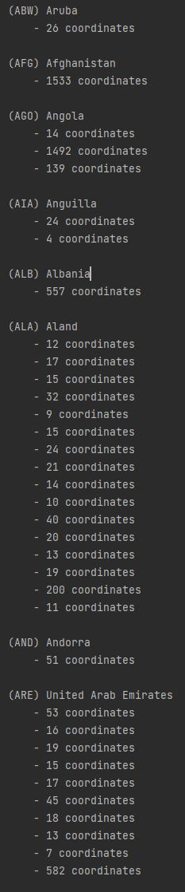

# SER Labo3
Autheurs:
- da Silva Marques Fabio
- Forestier Quentin

Date: 25 mai 2021

## Desciptif des classes
### Coordinate
Cette classe a pour but de représenter une coordonnée en 2 dimensions (x,y)

### Country
Cette classe permet de représenter un pays. On y retrouve les infos suivantes:
- Nom du pays
- Le nom ISO du pays
- les frontières

### GeoJson
Cette classe sert à convertir le fichier geojson en kml

Lors de l'instanciation de la classe celle-ci va parser le fichier geojson afin d'obtenir une liste de pays.
Cette liste de pays sera utilisée lors de l'appel a la methode generateKml qui se chargera de créer le fichier kml correspondant.

### Polygon
Cette classe représente un polygone qui correspond a la surface d'un pays.

### Main
Classe principale du programme qui permet d'utiliser la classe GeoJson afin de convertir le fichier geojson en fichier kml.

## Difficultées rencontrées
- trouver les informations pertinentes liées a la spécification des fichiers geojson
- trouver les informations pertinentes liées à la spécification des fichiers kml
- ajout de styles pour bien afficher les frontières

## Problèmes connus et non corrigés
Il n'y a actuellement aucun problème connu dans notre application

## Affichage du parsing du fichier geojson

## Affichage du résultat du fichier kml

## Nos apprentissages
- parsing de fichiers json a l'aide de la librairie json-simple
- trouver et interpreter des spécifications

## Conclusion
Nous pensons avoir réussi a répondre de manière exhaustive au travail qui était demandé pour ce labo.
Notre programme fonctionne et affiche le résultat souhaite dans la donnée.

__Signatures:__

